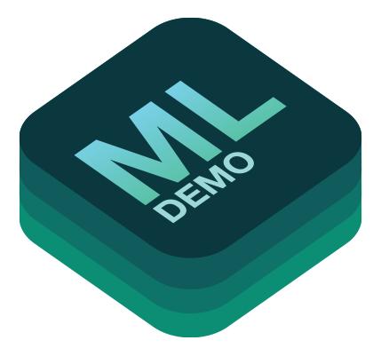
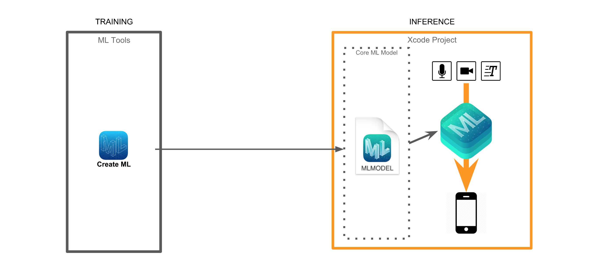
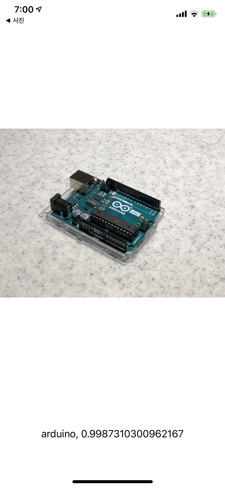
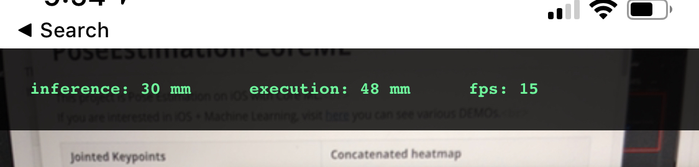

    

# Awesome Machine Learning DEMOs with iOS

We tackle the challenge of using machine learning models on iOS via Core ML and ML Kit (TensorFlow Lite).

[한국어 README](https://github.com/motlabs/iOS-Proejcts-with-ML-Models/blob/master/README_kr.md)

## Contents
- [Machine Learning Framework for iOS](#machine-learning-framework-for-ios)
  - [Flow of Model When Using Core ML](#Flow-of-Model-When-Using-Core-ML)
  - [Flow of Model When Using Create ML](#Flow-of-Model-When-Using-Create-ML)
- [Baseline Projects](#Baseline-Projects)
  - [Image Classification](#Image-Classification)
  - [Object Detection & Recognition](#Object-Detection--Recognition)
  - [Image Estimation](#Image-Estimation)
  - [Image Segmentation](#Image-Segmentation)
- [Application Projects](#Application-Projects)
  - [Annotation Tool](#Annotation-Tool)
- [Create ML Projects](#Create-ML-Projects)
- [Performance](#Performance)
  - [📏Measure module](#measure-module)
  - [Implements](#Implements)
- [See also](#See-also)

## Machine Learning Framework for iOS

- [Core ML](https://developer.apple.com/documentation/coreml)
- [ML Kit](https://developers.google.com/ml-kit/)
- [fritz](https://www.fritz.ai/)
- etc. ([Tensorflow Lite](https://www.tensorflow.org/mobile/tflite/), ~~[Tensorflow Mobile](https://www.tensorflow.org/mobile/)~~`DEPRECATED`)

### Flow of Model When Using Core ML

The overall flow is very similar for most ML frameworks. Each framework has its own compatible model format. We need to take the model created in TensorFlow and **convert it into the appropriate format, for each mobile ML framework**.

Once the compatible model is prepared, you can run the inference using the ML framework. Note that you must perform **pre/postprocessing** manually.

> If you want more explanation, check [this slide(Korean)](https://docs.google.com/presentation/d/1wA_PAjllpLLcFPuZcERYbQlPe1Ipb-bzIZinZg3zXkg/edit?usp=sharing).

### Flow of Model When Using Create ML

## Baseline Projects

#### DONE

- Using built-in model with Core ML

- Using built-in on-device model with ML Kit
- Using custom model for Vision with Core ML and ML Kit
- Object Detection with Core ML

#### TODO

- Object Detection with ML Kit
- Using built-in cloud model on ML Kit
  - Landmark recognition
- Using custom model for NLP with Core ML and ML Kit
- Using custom model for Audio with Core ML and ML Kit
  - Audio recognition
  - Speech recognition
  - TTS

### Image Classification

| Name | DEMO | Note |
| ---- | ---- | ---- |
| [ImageClassification-CoreML](https://github.com/tucan9389/ImageClassification-CoreML) | 

 | - |
| [MobileNet-MLKit](https://github.com/tucan9389/MobileNet-MLKit) | 

 | - |

### Object Detection & Recognition

| Name | DEMO | Note |
| ---- | ---- | ---- |
| [ObjectDetection-CoreML](https://github.com/tucan9389/ObjectDetection-CoreML) | 

 | - |
| [TextDetection-CoreML](https://github.com/tucan9389/TextDetection-CoreML) | 

 | - |
| [TextRecognition-MLKit](https://github.com/tucan9389/TextRecognition-MLKit) | 

 | - |
| [FaceDetection-MLKit](https://github.com/tucan9389/FaceDetection-MLKit) | 

 | - |

### Image Estimation

| Name | DEMO | Note |
| ---- | ---- | ---- |
| [PoseEstimation-CoreML](https://github.com/tucan9389/PoseEstimation-CoreML) | 

 | - |
| [PoseEstimation-MLKit](https://github.com/tucan9389/PoseEstimation-MLKit) | 

 | - |
| [FingertipEstimation-CoreML](https://github.com/tucan9389/FingertipEstimation-CoreML) | 

 | - |
| [DepthPrediction-CoreML](https://github.com/tucan9389/DepthPrediction-CoreML) | 

 | - |

### Image Segmentation

| Name | DEMO | Note |
| ---- | ---- | ---- |
| [ImageSegmentation-CoreML](https://github.com/tucan9389/ImageSegmentation-CoreML) |  

 | - |

## Application Projects

| Name | DEMO | Note |
| ---- | ---- | ---- |
| [dont-be-turtle-ios](https://github.com/motlabs/dont-be-turtle-ios) | 

 | - |
| [WordRecognition-CoreML-MLKit](https://github.com/tucan9389/WordRecognition-CoreML-MLKit)(preparing...) | 

 | Detect character, find a word what I point and then recognize the word using Core ML and ML Kit. |

### Annotation Tool

| Name | DEMO | Note |
| ---- | ---- | ---- |
| [KeypointAnnotation](https://github.com/tucan9389/KeypointAnnotation) | 

 | Annotation tool for own custom estimation dataset |

## Create ML Projects

| Name | Create ML DEMO | Core ML DEMO | Note |
| ------ | ------------------------------------------------------------ | ---------------------------------- | ------ |
| [SimpleClassification-CreateML-CoreML](https://github.com/tucan9389/SimpleClassification-CreateML-CoreML) |  |  | A Simple Classification Using Create ML and Core ML |

## Performance

Execution Time: Inference Time + Postprocessing Time

|              (with iPhone X) | Inference Time(ms) | Execution Time(ms) |   FPS   |
| ---------------------------: | :----------------: | :----------------: | :-----: |
|   ImageClassification-CoreML |         40         |         40         |   23    |
|              MobileNet-MLKit |        120         |        130         |    6    |
|       ObjectDetection-CoreML |  100 ~ 120         |    110 ~ 130       |    5    |
|         TextDetection-CoreML |         12         |         13         | 30(max) |
|        TextRecognition-MLKit |       35~200       |       40~200       |  5~20   |
|        PoseEstimation-CoreML |         51         |         65         |   14    |
|         PoseEstimation-MLKit |        200         |        217         |    3    |
|       DepthPrediction-CoreML |        624         |        640         |    1    |
|    ImageSegmentation-CoreML |        178         |        509         |    1    |
| WordRecognition-CoreML-MLKit |         23         |         30         |   14    |
| FaceDetection-MLKit          |         -          |          -         |   -     |

### 📏Measure module

You can see the measured latency time for inference or execution and FPS on the top of the screen.

> If you have more elegant method for measuring the performance, suggest on issue!

### Implements

|                            | Measure📏 | Unit Test | Bunch Test |
| -------------------------: | :-------: | :-------: | :--------: |
| ImageClassification-CoreML |    O      |     X     |     X      |
|            MobileNet-MLKit |    O      |     X     |     X      |
|     ObjectDetection-CoreML |    O      |     O     |     X      |
|       TextDetection-CoreML |    O      |     X     |     X      |
|      TextRecognition-MLKit |    O      |     X     |     X      |
|      PoseEstimation-CoreML |    O      |     O     |     X      |
|       PoseEstimation-MLKit |    O      |     X     |     X      |
|     DepthPrediction-CoreML |    O      |     X     |     X      |
|  ImageSegmentation-CoreML |    O      |     X     |     X      |

## See also

- [Core ML | Apple Developer Documentation](https://developer.apple.com/documentation/coreml)
- [Machine Learning - Apple Developer](https://developer.apple.com/machine-learning/)
- [ML Kit - Firebase](https://developers.google.com/ml-kit/)
- [Apple's Core ML 2 vs. Google's ML Kit: What's the difference?](https://venturebeat.com/2018/06/05/apples-core-ml-2-vs-googles-ml-kit-whats-the-difference/)
- [iOS에서 머신러닝 슬라이드 자료](https://docs.google.com/presentation/d/1wA_PAjllpLLcFPuZcERYbQlPe1Ipb-bzIZinZg3zXkg/edit?usp=sharing)
- [MoT Labs Blog](https://motlabs.github.io/)

### WWDC

#### Core ML
- WWDC2019
  - [WWDC2019 256 Session - Advances in Speech Recognition](https://developer.apple.com/videos/play/wwdc2019/256/)
  - [WWDC2019 704 Session - Core ML 3 Framework](https://developer.apple.com/videos/play/wwdc2019/704/)
  - [WWDC2019 228 Session - Creating Great Apps Using Core ML and ARKit](https://developer.apple.com/videos/play/wwdc2019/228/)
  - [WWDC2019 232 Session - Advances in Natural Language Framework](https://developer.apple.com/videos/play/wwdc2019/232/)
  - [WWDC2019 222 Session - Understanding Images in Vision Framework](https://developer.apple.com/videos/play/wwdc2019/222/)
  - [WWDC2019 234 Session - Text Recognition in Vision Framework](https://developer.apple.com/videos/play/wwdc2019/234/)
- WWDC2018
  - [WWDC2018 708 Session - What’s New in Core ML, Part 1](https://developer.apple.com/videos/play/wwdc2018/708/)
  - [WWDC2018 716 Session - Object Tracking in Vision](https://developer.apple.com/videos/play/wwdc2018/716/)
  - [WWDC2018 717 Session - Vision with Core ML](https://developer.apple.com/videos/play/wwdc2018/717/)
  - [WWDC2018 709 Session - What’s New in Core ML, Part 2](https://developer.apple.com/videos/play/wwdc2018/709/)
  - [WWDC2018 713 Session - Introducing Natural Language Framework](https://developer.apple.com/videos/play/wwdc2018/713/)
- WWDC2017
  - [WWDC2017 710 Session - Core ML in depth](https://developer.apple.com/videos/play/wwdc2017/710/)
  - [WWDC2017 208 Session - Natural Language Processing and your Apps](https://developer.apple.com/videos/play/wwdc2017/208/)
  - [WWDC2017 510 Session - Advances in Core Image: Filters, Metal, Vision, and More](https://developer.apple.com/videos/play/wwdc2017/510/)
  - [WWDC2017 506 Session - Vision Framework: Building on Core ML](https://developer.apple.com/videos/play/wwdc2017/506/)
  - [WWDC2017 703 Session - Introducing Core ML](https://developer.apple.com/videos/play/wwdc2017/703/)

#### Create ML and Turi Create

- WWDC2019
  - [WWDC2019 424 Session - Training Object Detection Models in Create ML](https://developer.apple.com/videos/play/wwdc2019/424/)
  - [WWDC2019 426 Session - Building Activity Classification Models in Create ML](https://developer.apple.com/videos/play/wwdc2019/426/)
  - [WWDC2019 420 Session - Drawing Classification and One-Shot Object Detection in Turi Create](https://developer.apple.com/videos/play/wwdc2019/420/)
  - [WWDC2019 425 Session - Training Sound Classification Models in Create ML](https://developer.apple.com/videos/play/wwdc2019/425/)
  - [WWDC2019 428 Session - Training Text Classifiers in Create ML](https://developer.apple.com/videos/play/wwdc2019/428/)
  - [WWDC2019 427 Session - Training Recommendation Models in Create ML](https://developer.apple.com/videos/play/wwdc2019/427/)
  - [WWDC2019 430 Session - Introducing the Create ML App](https://developer.apple.com/videos/play/wwdc2019/430/)
- WWDC2018
  - [WWDC2018 712 Session - A Guide to Turi Create](https://developer.apple.com/videos/play/wwdc2018/712/)
  - [WWDC2018 703 Session - Introducing Create ML](https://developer.apple.com/videos/play/wwdc2018/703/)

#### Common ML

- WWDC2019
  - [WWDC2019 803 Session - Designing Great ML Experiences](https://developer.apple.com/videos/play/wwdc2019/803/)
  - [WWDC2019 614 Session - Metal for Machine Learning](https://developer.apple.com/videos/play/wwdc2019/614/)
  - [WWDC2019 209 Session - What's New in Machine Learning](https://developer.apple.com/videos/play/wwdc2019/209/)
- WWDC2018
  - [WWDC2018 609 Session - Metal for Accelerating Machine Learning](https://developer.apple.com/videos/play/wwdc2018/609/)
- WWDC2016
  - [WWDC2016 715 Session - Neural Networks and Accelerate](https://developer.apple.com/videos/play/wwdc2016/715/)
  - [WWDC2016 605 Session - What's New in Metal, Part 2](https://developer.apple.com/videos/play/wwdc2016/605/)  
