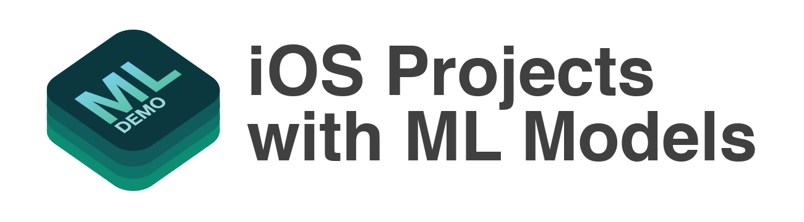

TensorFlow에서 만든 머신러닝 모델과 내장된 모델을 iOS에서 사용해봅니다.

## 들어가며

[MoT Lab](https://motlabs.github.io/)에 iOS 개발 담당으로 있으면서 만들어봤던 프로젝트들입니다. 공개하기에 좋은 코드는 아니지만 iOS에서 머신러닝을 돌려보았을때 어떤 것들이 어디까지 구현가능한지 영감을 얻는데 도움이 될 수 있지 않을까 생각했습니다.

공개된 프로젝트에대해 조언이나 개선사항은 이슈에 남겨주세요. PR은 언제나 환영입니다.

## iOS를 위한 ML 프레임워크

- [Core ML](https://developer.apple.com/documentation/coreml)
- [MLKit](https://developers.google.com/ml-kit/)
- etc. ([Tensorflow Lite](https://www.tensorflow.org/mobile/tflite/), [Tensorflow Mobile](https://www.tensorflow.org/mobile/))

### Core ML을 이용할 때의 모델 흐름도

전체적인 흐름은 대부분의 ML 프레임워크가 비슷하게 사용됩니다. 각자 프레임워크에 **호환되는 모델 포멧**이 있으며, Tensorflow에서 만들어진 모델 포멧으로부터 **변환**시키는 작업이 필요합니다.

호환되는 모델을 준비했다면, ML 프레임워크를 사용하여 추론을 실행합니다. 추론을 실행하기 전/후에 **전처리/후처리**를 해줘야하며, ML 프레임워크마다 편의성의 정도가 다릅니다.

> 더 자세한 설명은 [슬라이드 자료](https://docs.google.com/presentation/d/1wA_PAjllpLLcFPuZcERYbQlPe1Ipb-bzIZinZg3zXkg/edit?usp=sharing)를 참고해주세요.

## 모델 실행 예제

### 1. MobileNet

MobileNet 모델을 실행시켜본 예제입니다.

1. [MobileNet-CoreML](https://github.com/tucan9389/MobileNetApp-CoreML)
2. [MobileNet-MLKit](https://github.com/tucan9389/MobileNetApp-MLKit)

|                    [MobileNet-CoreML](https://github.com/tucan9389/MobileNetApp-CoreML)                    |                    [MobileNet-MLKit](https://github.com/tucan9389/MobileNetApp-MLKit)                     |
| :----------------------------------------------------------: | :----------------------------------------------------------: |
|  |  |

### 2. Pose Estimation

1. [PoseEstimation-CoreML](https://github.com/tucan9389/PoseEstimation-CoreML)
   1. PoseEstimationForMobile에서 제공하는 Core ML 모델 준비
   2. iOS에서 CoreML으로 실시간 추론
2. [PoseEstimation-MLKit](https://github.com/tucan9389/PoseEstimation-MLKit)
   1. PoseEstimationForMobile에서 제공하는 tflite 모델 준비
   2. iOS에서 ML Kit으로 실시간 추론

3. [dont-be-turtle-ios](https://github.com/motlabs/dont-be-turtle-ios)
   1. dont-be-turtle 프로젝트로 학습하여 모델 준비
   2. CoreML 모델로 변환
   3. iOS에서 CoreML으로 실시간 추론

4. [FingertipEstimation-CoreML](https://github.com/tucan9389/FingertipEstimation-CoreML)
   1. 직접 촬영한 5천개의 손가락 사진 준비
   2. KeypointAnnotation 앱으로 어노테이션 시켜 데이터셋 준비
   3. PoseEstimationForMobile 프로젝트로 학습하여 모델 생성
   4. CoreML 모델로 변환
   5. iOS에서 CoreML으로 실시간 추론

- [KeypointAnnotation](https://github.com/tucan9389/KeypointAnnotation)(준비중...) 
  : 커스텀 Estimation 데이터셋을 준비하기위한 어노테이션 툴

#### 2.1 Pose Estimation

|                    [PoseEstimation-CoreML](https://github.com/tucan9389/PoseEstimation-CoreML)                     |                     [PoseEstimation-MLKit](https://github.com/tucan9389/PoseEstimation-MLKit)                     |
| :----------------------------------------------------------: | :----------------------------------------------------------: |
|  |  |

| [dont-be-turtle-ios](https://github.com/motlabs/dont-be-turtle-ios)                                           |
| ------------------------------------------------------------ |
|  |

#### 2.2 Fingertip Estimation

| [FingertipEstimation-CoreML](https://github.com/tucan9389/FingertipEstimation-CoreML)                                   | KeypointAnnotation(preparing...)                             |
| ------------------------------------------------------------ | ------------------------------------------------------------ |
|  |  |

### 3. Object Detection

1. [SSDMobileNet-CoreML](https://github.com/tucan9389/SSDMobileNet-CoreML) : 90개의 물체를 인지(물체의 위치와 크기를 찾고 카테고리를 식별합니다).

| [SSDMobileNet-CoreML](https://github.com/tucan9389/SSDMobileNet-CoreML)                                          |
| ------------------------------------------------------------ |
|  |

### 4. TextDetection & Recognition

1. [TextDetection-CoreML](https://github.com/tucan9389/TextDetection-CoreML) : Vision의 내장된 모델을 사용하여 텍스트를 찾기.
2. [TextRecognition-MLKit](https://github.com/tucan9389/TextRecognition-MLKit) : Firebase의 내장된 모델을 사용하여 텍스트를 인식.
3. [WordRecognition-CoreML-MLKit](https://github.com/tucan9389/WordRecognition-CoreML-MLKit)(준비중...) 
   : Core ML의 내장된 Text Detection으로 글자를 찾고, 단어를 찾아서, ML Kit으로 단어를 인식.

   | [TextDetection-CoreML](https://github.com/tucan9389/TextDetection-CoreML) | [TextRecognition-MLKit](https://github.com/tucan9389/TextRecognition-MLKit) | [WordRecognition-CoreML-MLKit](https://github.com/tucan9389/WordRecognition-CoreML-MLKit) |
   | :----------------------------------------------------------: | :----------------------------------------------------------: | :----------------------------------------------------------: |
   |  |  |  |

### 5. Create ML과 Core ML을 사용한 간단한 분류

1. [SimpleClassification-CreateML-CoreML](https://github.com/tucan9389/SimpleClassification-CreateML-CoreML)

| Create ML                                                    | Core ML                            |
| ------------------------------------------------------------ | ---------------------------------- |
|  |  |

## 성능

> 실행시간: 추론시간 + 후처리시간
>
> WordRecognition-CoreML-MLKit: Text Detection(내장 Core ML 모델) + Text Recognition(내장 ML Kit 모델)

|                              | 추론시간(ms) | 실행시간(ms) |   FPS   |
| ---------------------------: | :----------: | :----------: | :-----: |
|             MobileNet-CoreML |      40      |      40      |   23    |
|              MobileNet-MLKit |     120      |     130      |    6    |
|        PoseEstimation-CoreML |      51      |      65      |   14    |
|         PoseEstimation-MLKit |     200      |     217      |    3    |
|          SSDMobileNet-CoreML |      72      |     180      |    5    |
|         TextDetection-CoreML |      12      |      13      | 30(max) |
|        TextRecognition-MLKit |    35~200    |    40~200    |  5~20   |
| WordRecognition-CoreML-MLKit |      23      |      30      |   14    |

### 📏Measure 모듈

데모 상단에서 추론시간, 실행시간, fps를 실시간으로 확인할 수 있습니다.

### 테스트

#### 단일 테스트

> 한 입력에대한 한 결과 출력
> 세부적인 결과 그리기
> 디버깅용 테스트?
>
> - Pose Estimation: point마다 점을 찍고 연결, 각 point마다 confidence 출력
> - ...

#### 묶음 테스트(준비중...)

> 여러 입력에대한 여러 결과를 종합적으로 분석
>
> - 평균 execution time, fps
> - 누적 execution time, fps...?
> - 총 execution time
> - rendering time
> - ...

## Author

- [tucan9389](https://github.com/tucan9389)

## See also

- [Core ML | Apple Developer Documentation](https://developer.apple.com/documentation/coreml)
- [Machine Learning - Apple Developer](https://developer.apple.com/machine-learning/)
- WWDC17 - Core ML 발표자료
  - [WWDC17 703 Session - Introducing Core ML](https://developer.apple.com/videos/play/wwdc2017/703/)
  - [WWDC17 710 Session - Core ML in depth](https://developer.apple.com/videos/play/wwdc2017/710/)
  - [WWDC17 506 Session - Vision Framework: Building on Core ML](https://developer.apple.com/videos/play/wwdc2017/506)
- WWDC18 - Core ML 2 발표자료
  - [WWDC18 708 Session - What’s New in Core ML, Part 1](https://developer.apple.com/videos/play/wwdc2018/708/)
  - [WWDC18 709 Session - What’s New in Core ML, Part 2](https://developer.apple.com/videos/play/wwdc2018/709/)
  - [WWDC18 717 Session - Vision with Core ML](https://developer.apple.com/videos/play/wwdc2018/717/)
- [ML Kit - Firebase](https://developers.google.com/ml-kit/)
- [Apple's Core ML 2 vs. Google's ML Kit: What's the difference?](https://venturebeat.com/2018/06/05/apples-core-ml-2-vs-googles-ml-kit-whats-the-difference/)
- [iOS에서 머신러닝 슬라이드 자료](https://docs.google.com/presentation/d/1wA_PAjllpLLcFPuZcERYbQlPe1Ipb-bzIZinZg3zXkg/edit?usp=sharing)
- [MoTLabs Blog](https://motlabs.github.io/)
